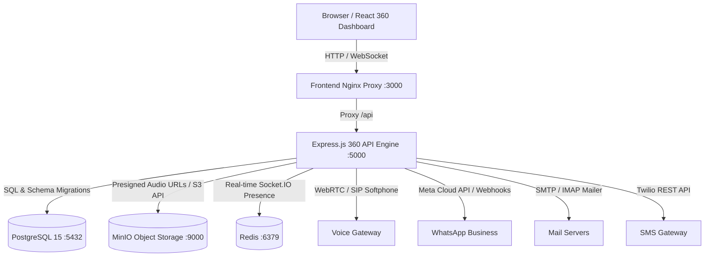

# 🚀 HackQubit CRM: 360° Profile-Centric Omnichannel CRM

A modern, production-grade, self-hosted CRM built around the **Customer 360° Profile**. Communication channels (WhatsApp, SMS, Email, Voice/Calls), Marketing Campaigns, Commercial Offers, Deals, Tasks, and Notes are unified around the customer identity.

---

## 🌟 Core Product Vision: Customer-First Architecture

Unlike channel-centric tools that force agents to think in disconnected silos, HackQubit CRM operates on a **Customer-First, Channel-Second** paradigm:

```
CUSTOMER 360° PROFILE
    │
    ├── Identity & Channels (contact_channels)
    │   ├── Phone / Voice (STUN/TURN WebRTC & SIP)
    │   ├── WhatsApp Cloud API (Meta Graph v18.0)
    │   ├── Email (SMTP/IMAP)
    │   ├── SMS (Twilio REST API)
    │   └── Extensible channels (Telegram, LinkedIn, etc.)
    │
    ├── Unified Communications (Unified Inbox & One-Click Send Everywhere)
    │   ├── WhatsApp Two-Way Webhook
    │   ├── SMS Two-Way Bridge
    │   ├── Email MIME Dispatcher
    │   └── Persistent Voice Softphone & MinIO Audio Player
    │
    ├── Commercial & Growth
    │   ├── Deals & Sales Pipeline Kanban
    │   ├── Commercial Offers Catalogue & Instant Dispatch
    │   ├── Multi-Channel Marketing Campaigns & Delivery Analytics
    │   └── Reusable Message Templates with {{variable}} substitution
    │
    └── Unified Chronological Timeline (9 Activity Sources)
        ├── Calls (durations, MinIO recordings, notes)
        ├── WhatsApp messages
        ├── Emails (inbound & outbound)
        ├── SMS messages
        ├── Internal Agent Notes
        ├── Pipeline Deals
        ├── Commercial Offers sent
        ├── Campaign deliveries & open rates
        └── Scheduled Tasks
```

---

## 🏗️ System Architecture



---

## ⚡ Quick Start: Running with Docker

### Prerequisites
- Docker & Docker Compose installed.

### Step 1: Populate Secrets
```bash
cp backend/.env.example backend/.env
# Edit backend/.env with your production credentials
```

### Step 2: Build & Launch All Services
```bash
docker compose up -d --build
```
This automatically initializes:
1. **PostgreSQL 15** with extensions `uuid-ossp`, `pg_trgm`, tables, and 9-channel `contact_timeline` view.
2. **MinIO Object Storage** and provisions buckets `call-recordings` and `attachments`.
3. **Redis 7** for real-time presence caching.
4. **Backend API Engine** on port 5000 with auto-migrations.
5. **React Frontend** served through Nginx on port 3000.

### Step 3: Access Endpoints
- **CRM Web Application:** [http://localhost:3000](http://localhost:3000)
- **Backend API & Health:** [http://localhost:5000/health](http://localhost:5000/health)
- **MinIO S3 Web Console:** [http://localhost:9001](http://localhost:9001)
- **PostgreSQL Database:** `localhost:5432`

---

## 💻 Running Locally (Development Mode)

### Backend
```bash
cd backend
npm install
# Ensure PostgreSQL is accessible, then run migrations:
npm run migrate
# Start backend server:
npm run dev # or npm start
```

### Frontend
```bash
cd frontend
npm install
npm start
# Opens http://localhost:3000 with hot-reloading
```

---

## 🔐 5-Tier Role-Based Access Control (RBAC)

The application enforces a granular 5-Tier RBAC policy at both database and API middleware levels:

| Tier | Role | Level | Privileges |
| :--- | :--- | :---: | :--- |
| **Tier 1** | Super Admin | 1 | Unrestricted root system access, DB operations, raw audit logs |
| **Tier 2** | Admin | 2 | Organization config, user & role provisioning, integration secrets |
| **Tier 3** | Manager | 3 | Team supervision, campaigns & offers creation, bulk export, call audits |
| **Tier 4** | Agent | 4 | Assigned customer handling, Send Everywhere, WhatsApp/SMS/Email/Call dispatch |
| **Tier 5** | Viewer | 5 | Read-only metrics, customer audits & timelines (no dispatch or delete) |

### Provisioning Initial Super Admin User
For security, no hardcoded default accounts exist. Create your initial admin:
```bash
node -e "const b=require('bcryptjs'); b.hash('YourStrongPassword', 12).then(console.log)"

# Then execute SQL insert:
INSERT INTO users (email, password_hash, full_name, role_id)
VALUES ('admin@yourcompany.com', '<generated_hash>', 'System Administrator', 1);
```

---

## 🎯 Key Features & Workflows

### 1. Customer 360° Profile
- **Global Search:** Find customers instantly by name, phone, email, WhatsApp number, company, or tags.
- **Header:** Lifetime deal value, total interaction count, preferred channel, tags, and lifecycle status badge.
- **Quick Actions:**
  - `[📞 Call Softphone]`
  - `[💬 WhatsApp]`
  - `[✉️ Email]`
  - `[📱 SMS]`
  - `[⚡ Send Everywhere]`
  - `[🏷️ Send Offer]`
  - `[➕ Add Note]`, `[☑️ Add Task]`, `[💼 Add Deal]`
- **8 Profile Tabs:** Overview, Conversations, Unified Timeline, Deals & Pipeline, Campaigns, Offers, Notes, Tasks.

### 2. Multi-Channel Customer Identity Resolution
Inbound messages from WhatsApp (`POST /api/whatsapp/webhook`), SMS (`POST /api/sms/webhook`), or Email (`POST /api/emails/inbound`) automatically resolve to the same customer profile via `identity.service.js`. Identifiers are linked into `contact_channels`, preventing duplicate customer fragments.

### 3. One-Click "Send Everywhere"
From any customer profile, click **⚡ Send Everywhere**:
1. Check desired delivery channels: `[x] WhatsApp`, `[x] SMS`, `[x] Email`.
2. Select a message template or compose custom text.
3. System interpolates variables like `{{first_name}}` and `{{company}}`.
4. Dispatches through each selected channel simultaneously.
5. Handles partial failures gracefully: returns real-time status for each channel and logs each delivery to the customer timeline.

### 4. Unified Omnichannel Inbox
- Filter by channel: **All**, **WhatsApp**, **Email**, **SMS**, **Calls**.
- Shows unread counters, last message snippet, and customer company.
- Select any conversation to read thread history and send in-line replies.
- Direct **Open 360° Profile** button to instantly navigate to the full customer context.

### 5. Marketing Campaigns
- Segment audience by lifecycle status (All, Customers, Prospects, Leads).
- Select delivery channels (WhatsApp, SMS, Email).
- Execute broadcast campaigns with variable templating.
- Track real-time metrics: Sent, Delivered, Failed, Opened, Clicked.

### 6. Commercial Offers Catalogue
- Maintain promotional packages with percentage, fixed cash, or custom discounts.
- Dispatch directly from customer profiles with personalized notes.
- Track offer engagement directly on customer timelines.

---

## 📡 API Reference Overview

| Endpoint | Method | Description |
| :--- | :---: | :--- |
| `/api/auth/login` | POST | Authenticate user & issue JWT |
| `/api/contacts` | GET, POST | List contacts with search / create contact with identity resolution |
| `/api/contacts/:id` | GET, PUT, DELETE | Fetch complete 360° profile / update / delete contact |
| `/api/contacts/:id/send-everywhere` | POST | One-click multi-channel dispatch |
| `/api/contacts/:id/send-offer` | POST | Dispatch commercial offer to contact |
| `/api/contacts/:id/channels` | POST, DELETE | Manage contact communication channels |
| `/api/inbox` | GET | Unified Omnichannel Inbox aggregator |
| `/api/campaigns` | GET, POST | List & create marketing campaigns |
| `/api/campaigns/:id/send` | POST | Execute multi-channel campaign send |
| `/api/offers` | GET, POST, PUT, DELETE | Commercial offers catalogue |
| `/api/templates` | GET, POST, PUT, DELETE | Message templates with variable placeholders |
| `/api/deals` | GET, PUT | Deals & sales pipeline stages |
| `/api/tasks` | GET, POST, PUT | Task scheduling & status toggles |
| `/api/calls` | GET, POST | Call logs & MinIO recording playback |
| `/api/whatsapp/send` | POST | Outbound Meta Graph API message |
| `/api/whatsapp/webhook` | GET, POST | Meta webhook verification & message intake |
| `/api/emails/send` | POST | Outbound Nodemailer SMTP mailer |
| `/api/sms/send` | POST | Outbound Twilio SMS dispatch |
| `/api/analytics/dashboard` | GET | KPI metrics & channel activity aggregation |

---

## 🛠️ Communication Provider Configuration

Configure your credentials in `backend/.env`:

### WhatsApp Cloud API (Meta)
```env
WHATSAPP_PHONE_NUMBER_ID=123456789012345
WHATSAPP_ACCESS_TOKEN=EAAG...permanent_token
WHATSAPP_VERIFY_TOKEN=your_custom_webhook_token
WHATSAPP_API_URL=https://graph.facebook.com/v18.0
```

### SMS (Twilio)
```env
TWILIO_ACCOUNT_SID=ACxxxxxxxxxxxxxxxxxxxxxxxxxxxxxxxx
TWILIO_AUTH_TOKEN=your_auth_token
TWILIO_PHONE_NUMBER=+1234567890
```

### Email (SMTP)
```env
SMTP_HOST=smtp.sendgrid.net
SMTP_PORT=587
SMTP_USER=apikey
SMTP_PASS=SG.xxxxxxxx
SMTP_FROM=Your Company CRM <sales@yourcompany.com>
```

### Voice (WebRTC & MinIO)
```env
STUN_SERVER=stun:stun.l.google.com:19302
MINIO_ENDPOINT=minio # or localhost
MINIO_PORT=9000
MINIO_ACCESS_KEY=minio_access_key
MINIO_SECRET_KEY=minio_secret_key
MINIO_BUCKET_RECORDINGS=call-recordings
```
*(If provider credentials are left as placeholders during local evaluation, mock delivery simulators allow full UI exploration without blocking workflows).*